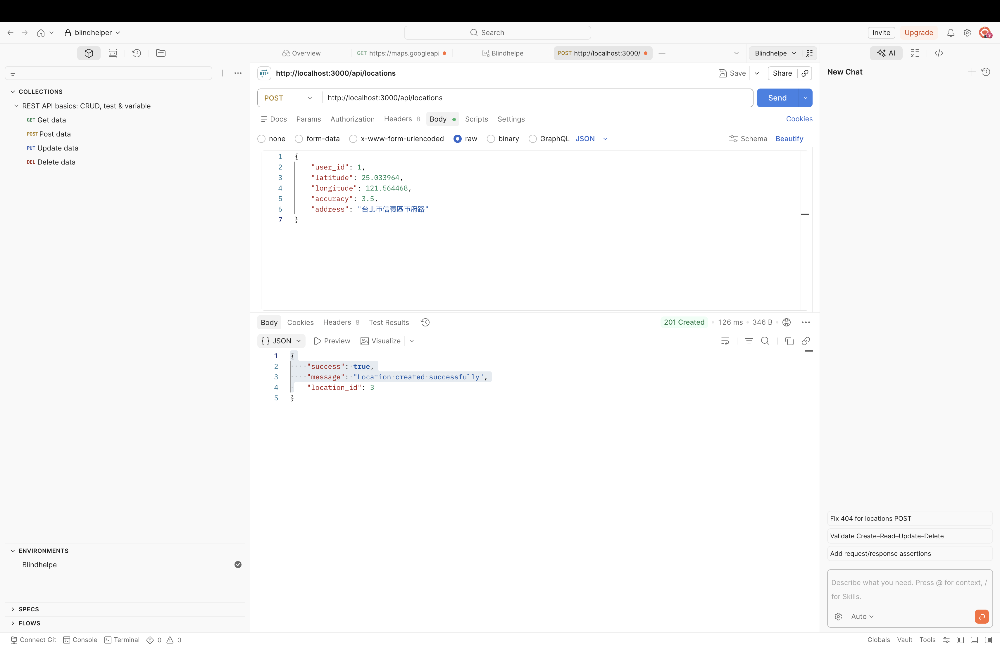
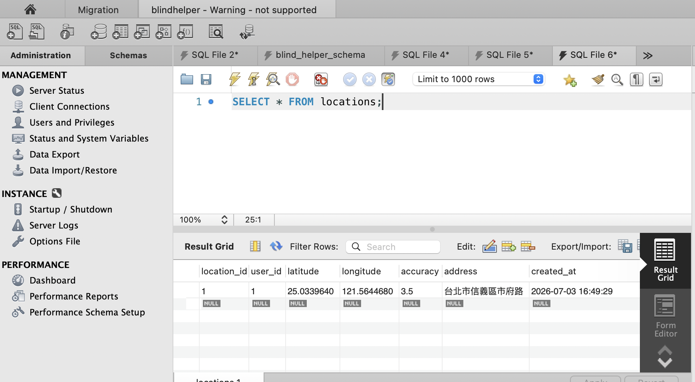
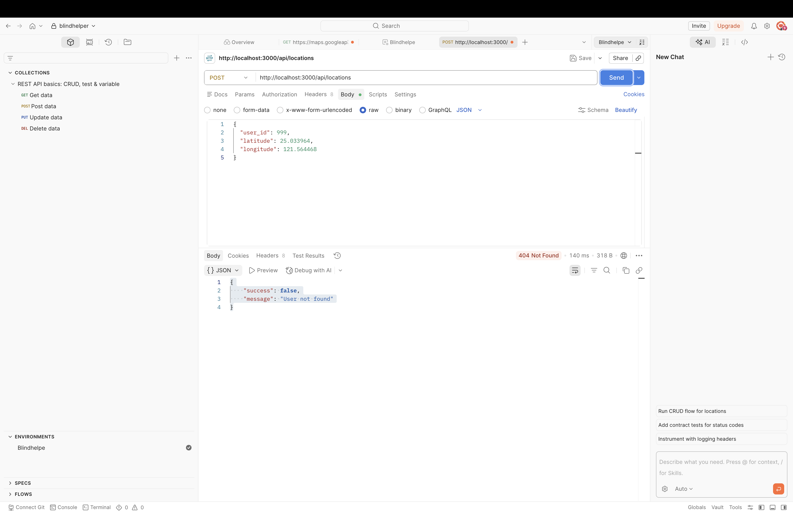

# POST /api/locations

## 功能
接收前端 GPS 經緯度並寫入 MySQL locations 資料表。

---

## Request

POST /api/locations

Body

```json
{
    "user_id": 1,
    "latitude": 25.033964,
    "longitude": 121.564468,
    "accuracy": 3.5,
    "address": "台北市信義區市府路"
}
```

---

## Success Response

HTTP 201

```json
{
    "success": true,
    "message": "Location created successfully",
    "location_id": 1
}
```

---

## Error Response

HTTP 404

```json
{
    "success": false,
    "message": "User not found"
}
```

---

## 測試結果


### 1. Postman 成功新增

成功送出 GPS 經緯度，API 回傳 HTTP 201 Created。


---
### 2. MySQL 資料寫入成功

確認 locations 資料表已成功新增定位資料。


---
### 3. Postman 錯誤測試

當 user_id 不存在時，API 回傳 HTTP 404 與 User not found。


---


