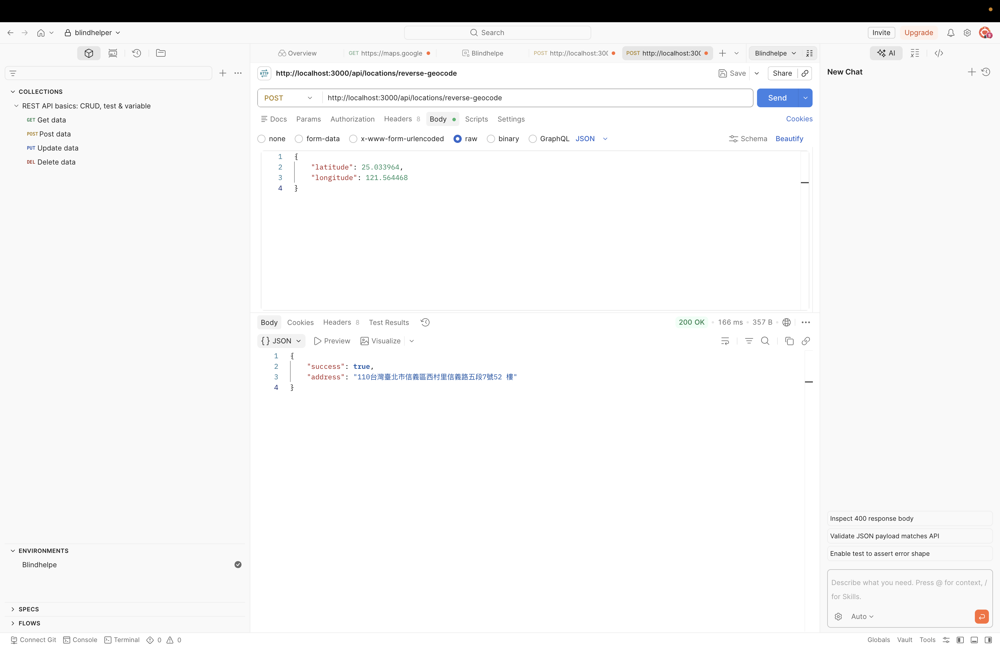
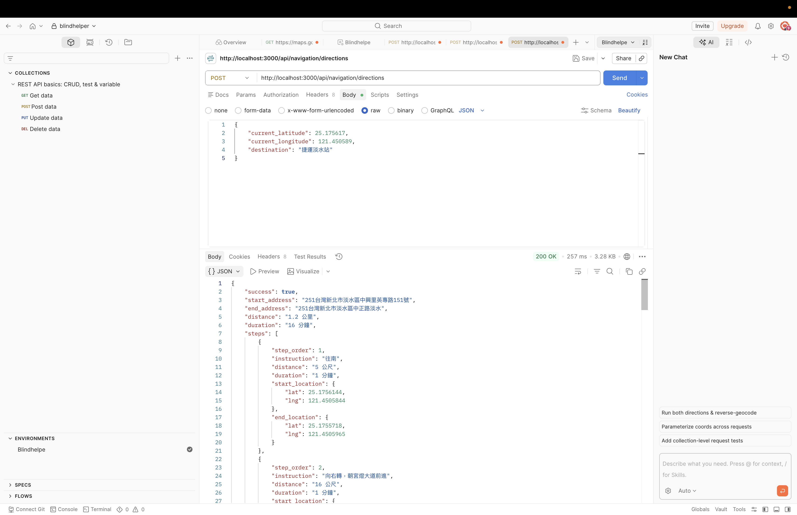
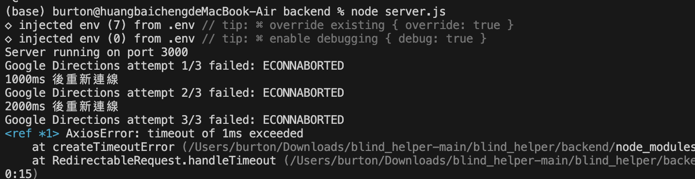
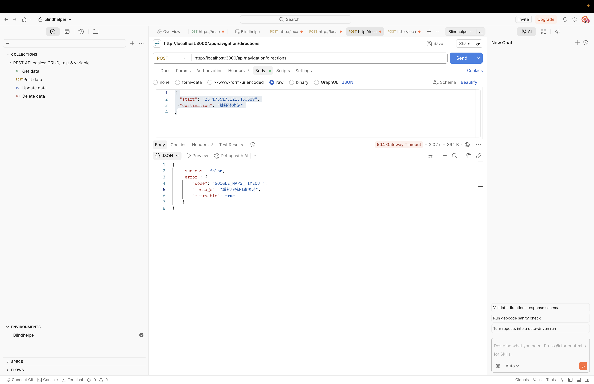
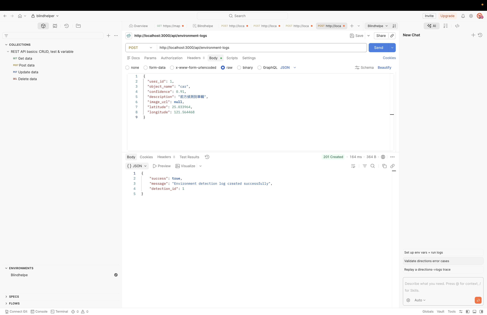

# Blind Helper Location、Navigation 與 Environment API

本文件說明 Blind Helper 後端目前已完成的定位、地址轉換、步行導航、API 重連與環境辨識紀錄功能。

---

# 1. POST /api/locations

## 功能

接收前端傳來的使用者 GPS 經緯度，透過 Google Geocoding API 自動取得地址，並將定位資料寫入 MySQL `locations` 資料表。

前端不需要自行傳送 `address`，地址會由後端依照經緯度自動取得。

---

## Request

```http
POST /api/locations
Content-Type: application/json
```

```json
{
  "user_id": 1,
  "latitude": 25.033964,
  "longitude": 121.564468,
  "accuracy": 3.5
}
```

### Request 欄位

| 欄位 | 型別 | 必填 | 說明 |
|---|---|---|---|
| user_id | Integer | 是 | 已登入使用者的 ID |
| latitude | Number | 是 | GPS 緯度 |
| longitude | Number | 是 | GPS 經度 |
| accuracy | Number | 否 | GPS 定位精準度 |

---

## Success Response

HTTP `201 Created`

```json
{
  "success": true,
  "message": "Location created successfully",
  "location_id": 1,
  "address": "110台灣臺北市信義區西村里信義路五段7號"
}
```

---

## Error Response

當 `user_id` 不存在時，回傳 HTTP `404 Not Found`：

```json
{
  "success": false,
  "error": {
    "code": "USER_NOT_FOUND",
    "message": "找不到使用者",
    "retryable": false
  }
}
```

當缺少必要欄位時，回傳 HTTP `400 Bad Request`：

```json
{
  "success": false,
  "error": {
    "code": "INVALID_REQUEST",
    "message": "user_id、latitude 與 longitude 為必填欄位",
    "retryable": false
  }
}
```

---

## 測試結果

### 1. Postman 成功新增

成功送出 GPS 經緯度，API 回傳 HTTP `201 Created`。


---

### 2. MySQL 資料寫入成功

確認 `locations` 資料表已成功新增定位資料與自動轉換後的地址。


---

### 3. Postman 錯誤測試

當 `user_id` 不存在時，API 回傳 HTTP `404 Not Found`。


---

# 2. POST /api/locations/reverse-geocode

## 功能

接收經緯度，透過 Google Geocoding API 將 GPS 座標轉換為街道地址。

---

## Request

```http
POST /api/locations/reverse-geocode
Content-Type: application/json
```

```json
{
  "latitude": 25.033964,
  "longitude": 121.564468
}
```

### Request 欄位

| 欄位 | 型別 | 必填 | 說明 |
|---|---|---|---|
| latitude | Number | 是 | GPS 緯度 |
| longitude | Number | 是 | GPS 經度 |

---

## Success Response

HTTP `200 OK`

```json
{
  "success": true,
  "address": "110台灣臺北市信義區西村里信義路五段7號52樓"
}
```

---

## Error Response

找不到地址時，回傳 HTTP `404 Not Found`：

```json
{
  "success": false,
  "error": {
    "code": "ADDRESS_NOT_FOUND",
    "message": "無法依照此經緯度取得地址",
    "retryable": false
  }
}
```

---

## 測試結果



---

# 3. POST /api/navigation/directions

## 功能

接收前端傳來的目前位置與目的地文字，呼叫 Google Maps Directions API，回傳步行距離、預估時間與逐步轉彎提示。

正式使用流程：

```text
Android 手機 GPS
        ↓
start = "緯度,經度"
        ↓
STT 語音辨識
        ↓
destination = "目的地文字"
        ↓
POST /api/navigation/directions
        ↓
Google Directions API
        ↓
回傳 steps 轉彎提示
        ↓
Android TTS 唸出 instruction
```

`start` 可以是：

- GPS 經緯度字串，例如：`25.175617,121.450589`
- 文字地址，例如：`淡江大學`

正式 Android 系統建議使用手機 GPS 取得 `start`，目的地則由 STT 語音辨識取得。

---

## Request

```http
POST /api/navigation/directions
Content-Type: application/json
```

```json
{
  "start": "25.175617,121.450589",
  "destination": "捷運淡水站"
}
```

### Request 欄位

| 欄位 | 型別 | 必填 | 說明 |
|---|---|---|---|
| start | String | 是 | GPS 字串或起點文字地址 |
| destination | String | 是 | STT 辨識出的目的地文字 |

---

## Success Response

HTTP `200 OK`

```json
{
  "success": true,
  "start_address": "251台灣新北市淡水區中興里英專路151號",
  "end_address": "251台灣新北市淡水區中正路淡水",
  "distance": "1.2 公里",
  "duration": "16 分鐘",
  "steps": [
    {
      "step_order": 1,
      "instruction": "往南",
      "distance": "5 公尺",
      "duration": "1 分鐘",
      "start_location": {
        "lat": 25.1756144,
        "lng": 121.4505844
      },
      "end_location": {
        "lat": 25.1755718,
        "lng": 121.4505965
      }
    },
    {
      "step_order": 2,
      "instruction": "向右轉，朝宮燈大道前進",
      "distance": "16 公尺",
      "duration": "1 分鐘",
      "start_location": {
        "lat": 25.1755718,
        "lng": 121.4505965
      },
      "end_location": {
        "lat": 25.1754633,
        "lng": 121.4505385
      }
    }
  ]
}
```

---

## 前端 TTS 使用方式

前端收到 Response 後，可依序讀取：

```text
steps[0].instruction
steps[1].instruction
steps[2].instruction
```

再將每一筆 `instruction` 交給 Android TextToSpeech 播放。

---

## Error Response

缺少起點或目的地時，回傳 HTTP `400 Bad Request`：

```json
{
  "success": false,
  "error": {
    "code": "INVALID_REQUEST",
    "message": "start 與 destination 為必填欄位",
    "retryable": false
  }
}
```

找不到步行路線時，回傳 HTTP `404 Not Found`：

```json
{
  "success": false,
  "error": {
    "code": "ROUTE_NOT_FOUND",
    "message": "找不到可用的步行路線",
    "retryable": false
  }
}
```

---

## 正常導航測試



---

# 4. Directions API 重連機制

## 功能

當後端呼叫 Google Directions API 發生暫時性網路錯誤或逾時時，自動重新連線。

此機制主要處理：

```text
Node.js 後端
      ↓
Google Directions API
```

若 Android 前端本身連不到後端，仍需要由 Android 端另外實作重試機制。

---

## 重試設定

最多嘗試三次：

1. 第一次失敗後等待 1 秒。
2. 第二次失敗後等待 2 秒。
3. 第三次仍失敗時停止重試。
4. 回傳統一錯誤格式給前端。

---

## 可重試情況

以下屬於暫時性錯誤，後端會自動重試：

- 連線逾時
- 連線中斷
- DNS 暫時失敗
- HTTP `429 Too Many Requests`
- HTTP `500 Internal Server Error`
- HTTP `502 Bad Gateway`
- HTTP `503 Service Unavailable`
- HTTP `504 Gateway Timeout`

---

## 不重試情況

以下錯誤重試也無法解決，因此不會自動重試：

- API Key 錯誤
- 欄位格式錯誤
- 缺少必要欄位
- `REQUEST_DENIED`
- `INVALID_REQUEST`
- `ZERO_RESULTS`
- 找不到步行路線

---

## Timeout Response

HTTP `504 Gateway Timeout`

```json
{
  "success": false,
  "error": {
    "code": "GOOGLE_MAPS_TIMEOUT",
    "message": "導航服務回應逾時",
    "retryable": true
  }
}
```

---

## Service Unavailable Response

HTTP `503 Service Unavailable`

```json
{
  "success": false,
  "error": {
    "code": "GOOGLE_MAPS_UNAVAILABLE",
    "message": "導航服務暫時無法使用，請稍後再試",
    "retryable": true
  }
}
```

---

## 重試測試方式

測試時，將 `requestGoogleDirections()` 中的：

```javascript
timeout: 5000
```

暫時改成：

```javascript
timeout: 1
```

重新啟動伺服器後呼叫 Directions API。

Terminal 會顯示：

```text
Google Directions attempt 1/3 failed: ECONNABORTED
1000ms 後重新連線
Google Directions attempt 2/3 failed: ECONNABORTED
2000ms 後重新連線
Google Directions attempt 3/3 failed: ECONNABORTED
```

測試完成後，必須將：

```javascript
timeout: 1
```

改回：

```javascript
timeout: 5000
```

---

## 重試測試結果

### Terminal 重試三次



---

### Postman 逾時回應



---

### 恢復正常設定後

將 timeout 改回 `5000ms` 後，Directions API 可正常回傳導航結果與 `steps`。


---

# 5. POST /api/environment-logs

## 功能

接收 AI 環境辨識結果，並寫入 MySQL `object_detections` 資料表。

可儲存：

- 使用者 ID
- 辨識物件名稱
- 辨識信心值
- 辨識說明
- 圖片網址
- 辨識位置經緯度
- 建立時間

---

## Request

```http
POST /api/environment-logs
Content-Type: application/json
```

```json
{
  "user_id": 1,
  "object_name": "car",
  "confidence": 0.91,
  "description": "前方偵測到車輛",
  "image_url": null,
  "latitude": 25.033964,
  "longitude": 121.564468
}
```

### Request 欄位

| 欄位 | 型別 | 必填 | 說明 |
|---|---|---|---|
| user_id | Integer | 是 | 已登入使用者 ID |
| object_name | String | 是 | 辨識到的物件名稱 |
| confidence | Number | 否 | 辨識信心值，範圍 0 至 1 |
| description | String | 否 | 辨識結果描述 |
| image_url | String | 否 | 辨識圖片網址 |
| latitude | Number | 否 | 辨識當下緯度 |
| longitude | Number | 否 | 辨識當下經度 |

---

## Success Response

HTTP `201 Created`

```json
{
  "success": true,
  "message": "Environment detection log created successfully",
  "detection_id": 1
}
```

---

## Error Response

使用者不存在時，回傳 HTTP `404 Not Found`：

```json
{
  "success": false,
  "error": {
    "code": "USER_NOT_FOUND",
    "message": "找不到使用者",
    "retryable": false
  }
}
```

信心值不在 0 到 1 之間時，回傳 HTTP `400 Bad Request`：

```json
{
  "success": false,
  "error": {
    "code": "INVALID_CONFIDENCE",
    "message": "confidence 必須介於 0 到 1",
    "retryable": false
  }
}
```

資料庫寫入失敗時，回傳 HTTP `500 Internal Server Error`：

```json
{
  "success": false,
  "error": {
    "code": "DATABASE_ERROR",
    "message": "環境辨識紀錄寫入失敗",
    "retryable": false
  }
}
```

---

## 測試結果

### 1. Postman 成功



---

### 2. MySQL 寫入成功

確認辨識物件、信心值、說明與經緯度已寫入 `object_detections`。


---

