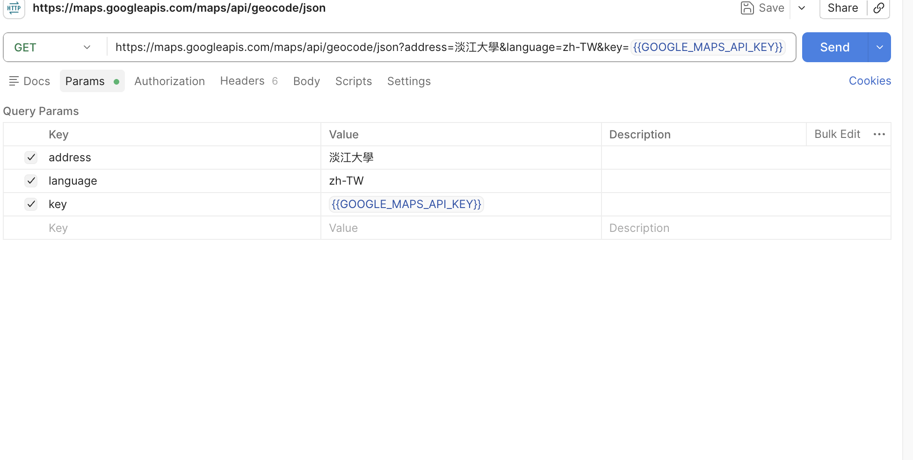
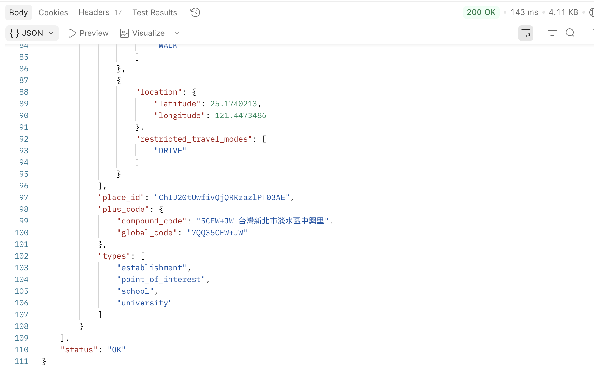

# Google Maps API Postman Test

## 測試目標

確認 Google Maps API Key 可正常使用，並能透過 Postman 成功呼叫 Geocoding API。

## API

GET https://maps.googleapis.com/maps/api/geocode/json?address=淡江大學&language=zh-TW&key={{GOOGLE_MAPS_API_KEY}}

## Parameters

| Key | Value |
|---|---|
| address | 淡江大學 |
| language | zh-TW |
| key | {{GOOGLE_MAPS_API_KEY}} |
## Postman Request

---

## Postman Response

## 測試結果

- HTTP Status：200 OK
- Google API Status：OK
- 成功取得淡江大學的地址與經緯度資料
- 成功回傳地址 (`formatted_address`)
- 成功回傳經緯度 (`geometry.location.latitude`、`geometry.location.longitude`)

## 安全性設定

- API Key 未直接寫入 URL，而是使用 Postman Environment Variable。
- API Key 未直接寫入 Request URL。
- API Key 未存放於 GitHub Repository。

