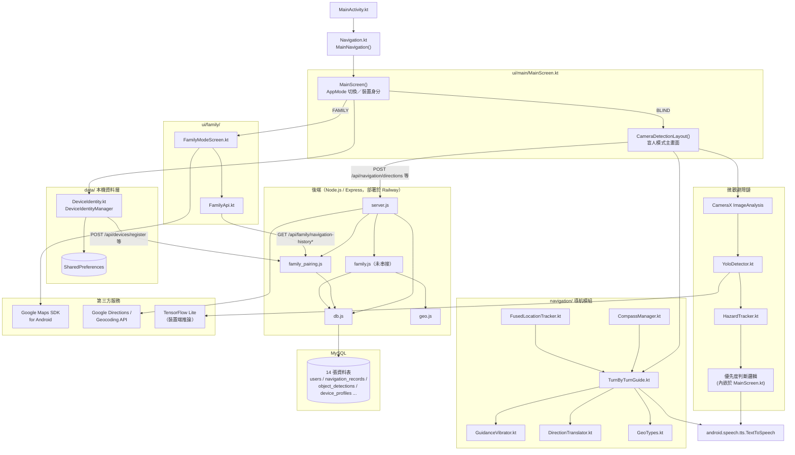

<!-- title: blind_helper 架構文件 -->

# blind_helper：檔案關聯與模組相依性

本文件根據 **目前 repo 裡實際存在的程式碼**（Android App + Node.js 後端）整理而成，可以直接作為專題系統文件書「系統架構」章節的素材。

---

## 0. 先說清楚：跟原始需求用詞的落差

你原本的需求描述裡提到幾個名稱——`AudioPriorityArbiter`、`NavigationHistoryRepository`、`Room Database`、`WorkManager`——**目前程式碼裡沒有這幾個東西**。為了讓文件書內容跟實際程式碼對得起來（老師如果對照原始碼會直接看到差異），這裡先誠實說明實際情況，下面各章節都是照「真實存在的檔案與類別」寫的：

| 你提到的名稱 | 實際情況 |
|---|---|
| `AudioPriorityArbiter` | 不存在獨立類別。「哪個警報優先講、要不要打斷目前語音」的邏輯，是寫在 `MainScreen.kt` 裡 `CameraDetectionLayout()` 內的 `LaunchedEffect(detections)` 區塊裡（用 `isUrgent`、`priority`、`shouldPreempt` 幾個區域變數計算），不是一個獨立檔案。 |
| `NavigationHistoryRepository` | 不存在 Repository 類別/介面。家屬模式查詢導航紀錄，是 `ui/family/FamilyApi.kt` 裡兩個獨立的 suspend 函式（`fetchNavigationHistory`、`fetchNavigationDetail`）直接用 OkHttp 打後端 API，沒有經過額外的 Repository 抽象層。 |
| `Room Database` | **完全沒有使用 Room，App 本機沒有 SQLite 資料庫**。所有導航紀錄、警報紀錄都存在後端的 MySQL，手機端不留存歷史資料。手機本機唯一的持久化儲存是 `SharedPreferences`（用來快取 `device_id`／`user_id`／配對碼，見 `data/DeviceIdentity.kt`）。 |
| `WorkManager` | 沒有使用，App 裡沒有任何背景排程工作。 |
| （另外要說明） `MainScreenViewModel` / `DataRepository` | 專案模板裡本來就有這兩個檔案（`ui/main/MainScreenViewModel.kt`、`data/DataRepository.kt`），但**沒有任何地方實際建立或呼叫它們**，是模板留下的未使用程式碼，`MainScreen()` 的畫面狀態全部是用 Compose 的 `remember { mutableStateOf(...) }` 直接管理，沒有走 ViewModel。 |
| （另外要說明） `DepthEstimator.kt` | 存在一個 MiDaS 深度估計模型的包裝類別（連同 `assets/midas_2_1_small_quant.tflite` 模型檔），但**目前沒有被任何地方實例化使用**，距離判斷實際上是用 `YoloDetector.kt` 裡「物件底部到畫面底部的比例」這個幾何演算法算的，不是用深度模型。 |

以下內容都是按照上面「實際情況」欄位來寫的。

---

## 一、全專案檔案呼叫與相依關聯（Architecture & Dependency Flow）

### 1.1 App 進入點

```
MainActivity.kt
  └─ setContent { BlindGuideAppTheme { MainNavigation() } }      // theme/Theme.kt
       │
Navigation.kt
  └─ MainNavigation()
       └─ NavDisplay(backStack = [Main])                         // NavigationKeys.kt: Main : NavKey
            └─ entry<Main> { MainScreen(onItemClick, modifier) } // ui/main/MainScreen.kt
```

`Navigation.kt` 目前只註冊了一個畫面（`Main`），所以整個 App 事實上只有一個 Compose 導覽節點；App 內部真正的「切換畫面」（盲人模式／家屬模式）不是靠 Navigation3 的 backstack 做的，而是 `MainScreen()` 內部自己用一個 `AppMode` enum 狀態切換兩個 Composable。

### 1.2 `MainScreen()`：整個 App 的狀態中樞

`ui/main/MainScreen.kt` 裡的頂層 `MainScreen()` 函式，是整個 App 真正的「進入邏輯」：

```
MainScreen()
  ├─ 持有狀態：appMode（BLIND / FAMILY）、serverUrl、deviceProfile
  ├─ 建立 DeviceIdentityManager（data/DeviceIdentity.kt）
  │     └─ LaunchedEffect(serverUrl): deviceProfile == null 時呼叫 ensureRegistered()
  ├─ 要求相機/麥克風/定位權限
  └─ 依 appMode 分流：
        ├─ AppMode.BLIND  → CameraDetectionLayout(...)      // 同一個檔案裡的另一個 Composable
        └─ AppMode.FAMILY → FamilyModeScreen(...)            // ui/family/FamilyModeScreen.kt
```

### 1.3 微觀避障鏈（相機 → 語音警報）

這是「盲人模式」裡持續在背景跑的即時避障流程，對應你需求裡的「MainScreen → YoloDetector → HazardTracker → （優先度邏輯）→ TTS」：

```
CameraDetectionLayout()                          [MainScreen.kt]
  └─ CameraX ImageAnalysis.setAnalyzer(cameraExecutor) { imageProxy ->
        val bitmap = imageProxy.toBitmap()
        val results = detector.detect(bitmap, rotationDegrees)   ──▶ YoloDetector.kt
     }
        │  回傳 List<YoloDetector.Detection>
        ▼
  LaunchedEffect(detections) {
        tracker.update(detections)                                ──▶ HazardTracker.kt
        │  回傳 List<Pair<Detection, Float>>（Float = 面積變化率，代表「正在接近的速度」）
        ▼
        依 proximity / rate 算出 priority、isUrgent、shouldPreempt   ──▶ 邏輯內嵌在 MainScreen.kt，
        │                                                              沒有獨立檔案
        ▼
        tts?.speak(alertMsg, QUEUE_FLUSH 或 QUEUE_ADD, ...)         ──▶ android.speech.tts.TextToSpeech
  }
```

`YoloDetector.detect()` 內部呼叫 TensorFlow Lite 的 `Interpreter.run()`，模型檔是 `assets/yolo26s_float32.tflite`（`YoloDetector(context, "yolo26s_float32.tflite")` 在 `CameraDetectionLayout()` 裡建立時寫死指定）。

### 1.4 宏觀導航鏈（語音下目的地 → 逐步轉彎提示）

```
使用者語音「我要去淡水捷運站」
  └─ SpeechRecognizer.onResults()                              [MainScreen.kt]
       └─ handleVoiceCommand(context, text, serverUrl, lat, lng, userId, tts) {...}
            └─ requestDirections(serverUrl, lat, lng, destination, userId)   ── OkHttp POST ──▶
                                                                                 /api/navigation/directions
                                                                                        │
                                                                              [server.js] ─▶ axios ─▶
                                                                              Google Directions API
                                                                                        │
                                                                              INSERT INTO navigation_records
                                                                                        │
            ◀── DirectionsResponse { steps[], navigation_id, ... } ──────────────────────┘
       └─ navigationResult 更新
            └─ LaunchedEffect(navigationResult) {
                    startNavigationSession(...)                  ── PATCH /api/navigation/:id/start ──▶ server.js
                    val guide = TurnByTurnGuide(steps, speak, vibrateShort, onCompleted)  // navigation/TurnByTurnGuide.kt
                    fusedLocationTracker.start { location -> guide.onLocation(GeoPoint(...)) }  // navigation/FusedLocationTracker.kt
               }
       └─ LaunchedEffect(compassAzimuth) { activeGuide?.onAzimuth(compassAzimuth) }   // navigation/CompassManager.kt
```

`TurnByTurnGuide` 內部再呼叫 `navigation/GeoTypes.kt`（距離/方位角計算）與 `navigation/DirectionTranslator.kt`（把方位角換算成「向左轉／向右前方走」中文詞），三階段（15m／5m／2~3m）到點時透過建構子傳入的 `speak` 與 `vibrateShort` callback，分別呼叫回 `MainScreen.kt` 裡的 `tts?.speak(...)` 與 `navigation/GuidanceVibrator.kt` 的 `shortDoubleBuzz()`。導航結束或使用者按「結束導航」時呼叫 `finishNavigationSession(...)` → `PATCH /api/navigation/:id/finish`。

導航過程中，相機警報若命中危險物件，會額外呼叫 `reportEnvironmentAlert(...)` → `POST /api/environment-logs`（帶上目前的 `navigation_id`），供家屬模式回放時在地圖上標記。

### 1.5 家屬模式鏈

```
CameraDetectionLayout 內的 👪 按鈕 → onSwitchToFamilyMode() → MainScreen() 切換 appMode = FAMILY
  └─ FamilyModeScreen(serverUrl, deviceProfile, ...)          [ui/family/FamilyModeScreen.kt]
       ├─ LaunchedEffect(activePairingCode) {
       │      fetchNavigationHistory(serverUrl, code)          ── GET /api/family/navigation-history ──▶
       │  }                                                     [ui/family/FamilyApi.kt]         [family_pairing.js]
       │                                                                                                │
       │                                                                            SELECT navigation_records
       │                                                                            LEFT JOIN object_detections
       └─ 點「查看詳情」→ NavigationDetailOverlay
              └─ fetchNavigationDetail(serverUrl, navigationId, code) ── GET /api/family/navigation-history/:id ──▶
                     │                                                                                  │
                     │                                            回傳 { navigation, path[], alerts[] }（family_pairing.js）
                     ▼
              NavigationRouteMap(path, alerts)  ── com.google.maps.android.compose.GoogleMap（Maps SDK for Android）
```

`family_pairing.js` 是靠 `device_profiles` 表把「裝置」跟「MySQL 既有的 `users` 表」串起來（`DeviceIdentityManager.ensureRegistered()` → `POST /api/devices/register` 會建立一筆 `users` + 一筆 `device_profiles`），這樣既有的 `navigation_records`、`object_detections` 完全不用改資料表結構就能直接沿用。

另外要提醒一件事：後端還有一個 `backend/family.js`（即時 GPS 軌跡／停留點模組，對應 `location_logs`、`stay_points`、`device_status` 三張表），這是**先前規劃的「網頁版家屬地圖儀表板」用的，現階段沒有被 Android App 呼叫**，屬於已掛載在 `server.js` 上、但目前沒有生產流量的獨立模組，寫文件書時如果要提，建議註明「保留供未來擴充，目前未串接」。

---

## 二、各核心檔案/類別的職責與輸入輸出（Class Contracts & I/O）

### 2.1 Android 前端

| 檔案 | 類別／函式 | 輸入 | 輸出／對外提供的方法 |
|---|---|---|---|
| `MainActivity.kt` | `MainActivity` | Android `Bundle?`（`onCreate`） | 無回傳，掛載 Compose 畫面樹 |
| `Navigation.kt` | `MainNavigation()` | 無參數 | 渲染 `NavDisplay`，內部呼叫 `MainScreen(onItemClick, modifier)` |
| `ui/main/MainScreen.kt` | `MainScreen(onItemClick, modifier)` | `onItemClick: (NavKey)->Unit` | 依 `AppMode` 渲染 `CameraDetectionLayout` 或 `FamilyModeScreen` |
| ″ | `CameraDetectionLayout(serverUrl, onServerUrlChange, deviceProfile, onSwitchToFamilyMode, modifier)` | 伺服器網址、裝置身分、模式切換 callback | 相機預覽 + 語音辨識 + 危險警報 UI + 導航步驟清單 UI；內部建立/持有 TTS、YoloDetector、HazardTracker、CompassManager、FusedLocationTracker、TurnByTurnGuide 等物件實例 |
| ″ | `requestDirections(serverUrl, lat, lng, destination, userId)` | 目前座標、目的地文字、使用者 ID（可為空） | `DirectionsResponse`（`suspend`，內部呼叫 `POST /api/navigation/directions`） |
| ″ | `requestReverseGeocode(serverUrl, lat, lng)` | 座標 | `String`（地址文字，呼叫 `POST /api/locations/reverse-geocode`） |
| ″ | `handleVoiceCommand(context, text, serverUrl, lat, lng, userId, tts, onDirectionsResult)` | 語音辨識文字、目前座標、TTS 實例 | 無回傳；依文字內容分流「查詢位置」或「規劃路線」，透過 `onDirectionsResult` 回呼結果 |
| ″ | `startNavigationSession` / `finishNavigationSession` | `navigationId`、`userId`、（結束時另加 `status`） | `Unit`（fire-and-forget，呼叫 `PATCH /api/navigation/:id/start`／`/finish`） |
| ″ | `reportEnvironmentAlert(serverUrl, userId, navigationId, objectName, description, latitude, longitude)` | 警報內容 + 目前座標 + 目前導航 ID | `Unit`（呼叫 `POST /api/environment-logs`） |
| `YoloDetector.kt` | `YoloDetector(context, modelPath)` | 建構時：模型檔名（`assets/` 底下） | `detect(bitmap, rotationDegrees): List<Detection>`；`close()` 釋放原生資源（已加鎖保護，避免相機執行緒與畫面切換同時存取造成原生層閃退） |
| `ui/main/HazardTracker.kt` | `HazardTracker` | `update(detections: List<Detection>)` | `List<Pair<Detection, Float>>`（Detection 配對「面積變化率」，正值代表正在靠近） |
| `ui/main/DepthEstimator.kt` | `DepthEstimator`（**未使用**） | `estimateDepth(bitmap): FloatArray` | 深度圖（256×256），目前無任何呼叫端 |
| `ui/main/MainScreenViewModel.kt` | `MainScreenViewModel`（**未使用**） | `DataRepository` | `StateFlow<MainScreenUiState>`，無任何 Composable 注入使用 |
| `data/DataRepository.kt` | `DefaultDataRepository`（**未使用**） | 無 | `Flow<List<String>>`（固定回傳 `["Android"]`，模板殘留） |
| `data/DeviceIdentity.kt` | `DeviceIdentityManager(context)` | 無（內部讀寫 `SharedPreferences`） | `ensureRegistered(serverUrl): DeviceProfile?`、`regenerateCode(serverUrl): String?`、`cachedProfile(): DeviceProfile?` |
| `navigation/GeoTypes.kt` | 頂層函式 | 兩個 `GeoPoint` 或角度值 | `distanceMeters()`、`bearingDegrees()`、`normalizeAngle()`、`normalizeAngleDiff()`、`angleDiffTo()`（純函式，無副作用） |
| `navigation/DirectionTranslator.kt` | `object DirectionTranslator` | 角度差 / 原始路線文字 | `relativeDirectionPhrase(Float): String`、`stripCompassWords(String): String` |
| `navigation/CompassManager.kt` | `CompassManager(context, onAzimuthChanged)` | `SensorManager` 事件 | 持續呼叫 `onAzimuthChanged(Float)`；`start()` / `stop()` |
| `navigation/FusedLocationTracker.kt` | `FusedLocationTracker(context)` | `start(intervalMs, onLocation)` | 持續呼叫 `onLocation(android.location.Location)`；`stop()` |
| `navigation/GuidanceVibrator.kt` | `GuidanceVibrator(context)` | 無 | `shortDoubleBuzz()` |
| `navigation/TurnByTurnGuide.kt` | `TurnByTurnGuide(steps, speak, vibrateShort, onStepAdvanced, onCompleted)` | `onLocation(GeoPoint)`、`onAzimuth(Float)` | 依三階段距離門檻觸發 `speak`／`vibrateShort` callback；`isFinished: Boolean` |
| `ui/family/FamilyModeScreen.kt` | `FamilyModeScreen(serverUrl, deviceProfile, onRegenerateCode, onRetryRegistration, onSwitchToBlindMode, modifier)` | 裝置身分、伺服器網址 | 配對碼顯示/查詢輸入框 + 導航紀錄列表 + 詳情地圖 UI |
| `ui/family/FamilyApi.kt` | 頂層函式 | `serverUrl`、`pairingCode`（詳情另需 `navigationId`） | `fetchNavigationHistory(): NavigationHistoryResponse`、`fetchNavigationDetail(): NavigationDetailResponse` |

### 2.2 Node.js 後端

| 檔案 | 職責 | 對外路由／匯出 |
|---|---|---|
| `server.js` | Express 主程式，掛載所有既有業務路由，並掛載 `family.js`、`family_pairing.js` 兩個 router | `/api/health`、`/api/locations`、`/api/locations/reverse-geocode`、`/api/navigation/directions`、`/api/navigation/:id/start`、`/api/navigation/:id/finish`、`/api/environment-logs`、`/api/app-sessions/*`、`/api/usage-events`、`/api/feedback*`、`/api/records/daily`、`/api/analytics/usage` |
| `family_pairing.js` | App 內建家屬模式：裝置配對碼、導航紀錄查詢 | `POST /api/devices/register`、`POST /api/devices/:user_id/regenerate-code`、`GET /api/family/navigation-history`、`GET /api/family/navigation-history/:navigation_id` |
| `family.js` | 即時 GPS 軌跡／停留點偵測（**目前 App 未呼叫**） | `POST /api/tracking/ping`、`POST /api/device/heartbeat`、`GET /api/family/overview` |
| `db.js` | 建立並匯出 MySQL 連線池（`mysql2/promise`） | `module.exports = pool`，供其餘檔案 `db.execute(...)` |
| `geo.js` | 共用地理計算 | `distanceMeters(a, b)` |

---

## 三、跨模組資料流向與介面合約（Data Flow & Data Classes）

| Data Class / 型別 | 定義檔案 | 內容 | 流向 |
|---|---|---|---|
| `YoloDetector.Detection` | `YoloDetector.kt` | 物件框座標、信心值、類別、`isDanger`、`distanceMeters`、`direction` | `YoloDetector.detect()` → `HazardTracker.update()` → `MainScreen.kt` 警報邏輯 → 畫面 Canvas 繪製框線 |
| `TrackedObject` | `HazardTracker.kt` | 單一物件跨影格的位置歷史、`getAreaChangeRate()` | `HazardTracker` 內部狀態，不外流 |
| `AlertLog` | `MainScreen.kt`（頂層） | `id`、`message`、`timestamp` | 警報邏輯 → `alertLogs` 清單狀態 → 畫面「警告日誌」分頁 |
| `GeoPoint` | `navigation/GeoTypes.kt` | `latitude`、`longitude` | `FusedLocationTracker` 回呼位置 / `TurnByTurnGuide.GuideStep` 內的座標 → 距離、方位角計算 |
| `TurnByTurnGuide.GuideStep` | `navigation/TurnByTurnGuide.kt` | `order`、`instruction`、`start`/`end: GeoPoint`、`maneuver` | 由 `MainScreen.kt` 依 `DirectionsResponse.steps` 轉換後傳入 `TurnByTurnGuide` 建構子 |
| `LatLngDto` | `MainScreen.kt` | `lat`、`lng` | 後端 `/api/navigation/directions` 回傳的每個 step 座標 → `DirectionStep.start_location` / `end_location` |
| `DirectionStep` | `MainScreen.kt` | `step_order`、`instruction`、`distance`、`duration`、`start_location`、`end_location`、`maneuver` | `DirectionsResponse.steps` 陣列元素，畫面步驟清單 + `TurnByTurnGuide` 共用 |
| `DirectionsRequest` / `DirectionsResponse` | `MainScreen.kt` | 請求：起點/終點/使用者 ID；回應：地址、距離、時間、`steps[]`、`navigation_id` | `requestDirections()` ↔ `server.js` `/api/navigation/directions` |
| `ApiErrorEnvelope` / `ApiErrorDetail` | `MainScreen.kt` | `{ success:false, error:{ code, message, retryable } }` | 所有後端錯誤回應的共同格式，`extractApiErrorMessage()` 解析出來用 TTS 念給使用者聽 |
| `DeviceProfile` | `data/DeviceIdentity.kt` | `userId`、`pairingCode`、`displayName` | `DeviceIdentityManager` ↔ `POST /api/devices/register`；貫穿 `MainScreen()`、`FamilyModeScreen()` |
| `NavigationRecordDto` | `ui/family/FamilyApi.kt` | `navigation_id`、起訖地址、距離/時長、`alert_count`、狀態、時間戳記 | `GET /api/family/navigation-history` 回應陣列元素 → 家屬模式列表卡片 |
| `NavigationDetailDto` / `AlertDto` / `LatLngDto2` | `ui/family/FamilyApi.kt` | 單趟導航詳情；每筆警報的物件名稱/座標/時間；路徑座標點 | `GET /api/family/navigation-history/:id` 回應 → 詳情地圖的 `Polyline`（路徑）與 `Marker`（警報） |
| MySQL 資料列（`navigation_records`、`object_detections` 等） | `doc/api/blind_helper_schema.sql` | 對應上述所有後端 API 的持久化資料 | `server.js` / `family_pairing.js` 透過 `db.execute()` 讀寫 |

---

## 四、Mermaid 檔案關聯架構圖



**圖例說明**：實線箭頭代表「呼叫／資料傳遞」方向；`未串接` 標註的節點（`family.js`）代表程式碼存在、已掛載路由，但目前沒有任何前端流量會打到它，屬於保留擴充功能。
